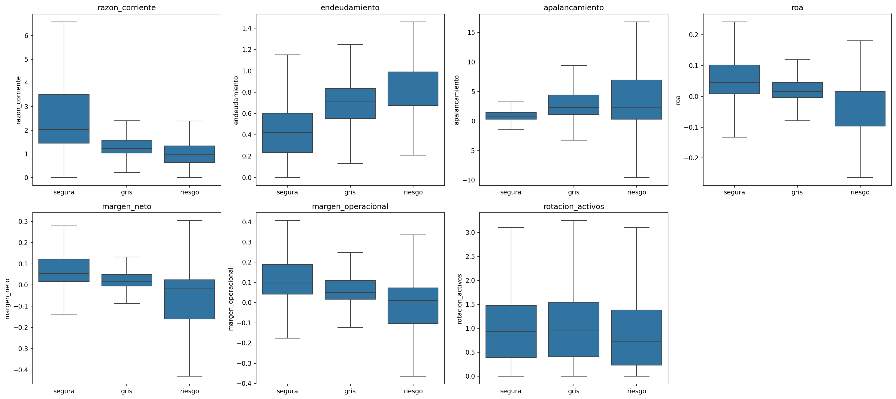

# Predicción de salud financiera empresarial en Colombia

Sistema de alerta temprana que, a partir de los ratios financieros de una empresa
en un año, predice su categoría de salud financiera en el año siguiente. Trabaja con
los estados financieros internos de empresas colombianas para anticipar el deterioro financiero antes de que ocurra.

## Motivación

A diferencia de un análisis de mercado (visión externa, basada en precios de acciones),
este proyecto adopta la mirada interna de la gestión: usa los estados financieros
reportados a la Superintendencia de Sociedades para conectar el perfil de ratios de
una empresa con decisiones concretas de gestión.

## Enfoque metodológico

- **Etiqueta objetiva con el Z''-Score de Altman** para mercados emergentes (Altman,
  1995), apropiado para empresas privadas y no manufactureras.
- **Planteamiento temporal (alerta temprana):** los ratios del año *t* predicen la
  salud en *t+1*, evitando la circularidad de predecir una etiqueta con las mismas
  variables que la generan.

## Datos

Estados financieros bajo NIIF ("Plenas individuales") reportados a la Superintendencia
de Sociedades (portal SIIS), 2018–2024. Panel: ~20.000 observaciones empresa-año;
~15.900 con etiqueta temporal.

## Hallazgos del análisis exploratorio

- **La etiqueta se valida con la realidad legal:** las empresas en procesos de
  insolvencia tienen ~el doble de probabilidad de caer en la zona de riesgo del Z''
  que las activas, lo que confirma que la etiqueta captura deterioro real.
- **Predictores del deterioro:** apalancamiento alto, liquidez baja y rentabilidad
  pobre anticipan el riesgo; la eficiencia (rotación) no discrimina — y ese es justo
  el ratio que el Z'' para emergentes descarta, así que los datos validan la elección.
- **Variación sectorial:** sectores cíclicos (construcción, turismo, minería) son más
  propensos al deterioro; el financiero, el menos.
- **Desbalance moderado:** ~60% segura, ~24% riesgo, ~16% gris.

## Estructura

financial-health-colombia/
├── data/ (raw / processed)
├── notebooks/ (01_carga, 02_ratios, 03_eda, 04_modelo)
├── src/ (ratios.py, altman.py)
├── tests/
├── outputs/
├── README.md
└── requirements.txt

## Reproducir

    python -m venv .venv
    .venv\Scripts\Activate.ps1
    pip install -r requirements.txt

Luego ejecutar los notebooks en orden (01 - 04).