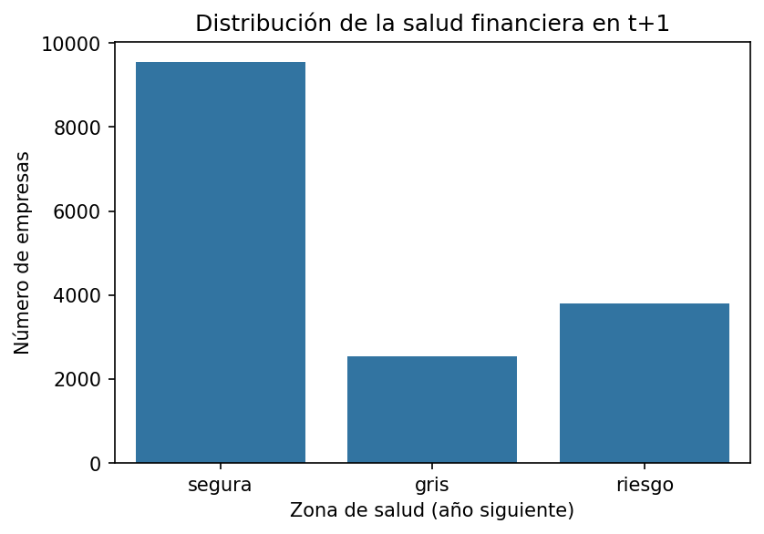
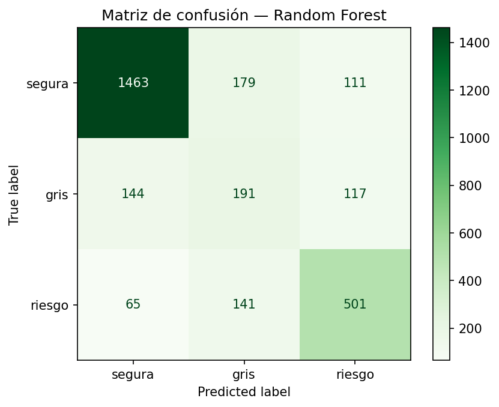
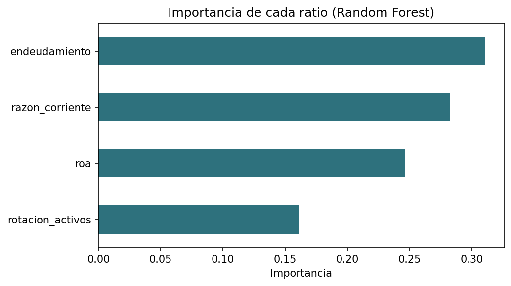

# Predicción de salud financiera empresarial en Colombia

Este proyecto construye un sistema de alerta temprana que, a partir de los ratios financieros de una empresa en un año, predice su categoría de salud financiera en el año siguiente. Se trabaja con los estados financieros internos de empresas colombianas, es decir, desde la perspectiva de la gestión interna, con el fin de anticipar el deterioro financiero antes de que ocurra.

## Motivación

A diferencia de un análisis de mercado, que observa a la empresa desde afuera mediante el precio de sus acciones, este proyecto adopta la mirada interna de la gestión. Se utilizan los estados financieros que las empresas reportan a la Superintendencia de Sociedades para conectar el perfil de ratios de una compañía con decisiones concretas de gestión.

## Enfoque metodológico

Se tomaron dos decisiones que le dan solidez al proyecto.

La primera fue usar una etiqueta objetiva. En lugar de inventar quién está sano y quién no, se calculó el puntaje Z'' de Altman para mercados emergentes (Altman, 1995), apropiado para empresas privadas y no manufactureras, que son la mayoría del tejido empresarial colombiano. Este puntaje clasifica a cada empresa en tres zonas: segura, gris y riesgo.

La segunda fue el planteamiento temporal. Los ratios del año actual se usan para predecir la salud del año siguiente. Así se evita la circularidad de predecir una etiqueta con las mismas variables que la generan, y el proyecto se convierte en una herramienta predictiva real y no en una simple descripción.

## Datos

Se utilizaron los estados financieros bajo NIIF (entradas "Plenas individuales") reportados a la Superintendencia de Sociedades a través del portal SIIS, para los años 2018 a 2024. Tras la limpieza, el panel final contiene alrededor de 20.000 observaciones de empresa por año, de las cuales cerca de 15.900 tienen etiqueta del año siguiente.

Entre las limitaciones conocidas están la posible ausencia de empresas en proceso de insolvencia en algunas bases, los ratios poco fiables de las empresas en etapa preoperativa, y la falta de ingresos operacionales en muchas empresas financieras y holdings.



## Hallazgos del análisis exploratorio

El análisis exploratorio reveló qué ratios anticipan el deterioro. Las empresas que caen en riesgo el año siguiente ya muestran, un año antes, mayor endeudamiento, menor liquidez y menor rentabilidad. La eficiencia, medida por la rotación de activos, casi no discrimina, que es justamente el ratio que el puntaje Z'' para mercados emergentes descarta de su fórmula. De esta forma, los datos colombianos de esta muestra validan la elección metodológica.


Además, la etiqueta se validó contra la realidad legal: las empresas en procesos de reorganización o reestructuración mostraron aproximadamente el doble de probabilidad de caer en la zona de riesgo que las empresas activas, lo que confirma que la etiqueta captura deterioro real. A nivel sectorial, los sectores cíclicos como la construcción, el turismo y la minería resultaron más propensos al deterioro, mientras que el financiero fue el más estable.

## Resultados

Se compararon dos modelos. La regresión logística sirvió como referencia interpretable, y el random forest como predictor final. Para una evaluación honesta se usó una división temporal: se entrenó con los años anteriores y se evaluó con el año más reciente, de modo que el modelo nunca ve el futuro durante el entrenamiento.

El random forest predice la salud del año siguiente con una exactitud del 74% y detecta el 71% de las empresas que caen en zona de riesgo, superando tanto a una línea base que siempre predice la clase mayoritaria (60%) como a la regresión logística (67%). Como en todo problema desbalanceado, la métrica clave no es la exactitud sino la capacidad de detectar la clase de riesgo, que es la que importa en una alerta temprana.



## Interpretación y conclusiones de gestión

Los ratios más influyentes en la predicción son el endeudamiento, la liquidez y la rentabilidad, mientras que la eficiencia aporta muy poco. Combinando la importancia de cada ratio con la dirección observada en el análisis exploratorio, la conclusión de gestión es clara: la salud financiera futura de una empresa se juega, ante todo, en el manejo de la deuda, la liquidez y la rentabilidad. Mejorar la productividad de los activos, por sí sola, no previene el deterioro.



## Estructura del proyecto

```
data/
    raw/         estados financieros crudos
    processed/   datos limpios y enriquecidos
notebooks/       01_carga, 02_ratios, 03_eda, 04_modelo
src/             ratios.py, altman.py
tests/           pruebas unitarias
outputs/         figuras y modelo entrenado
README.md
requirements.txt
```

## Cómo reproducir

Se crea y activa un entorno virtual, y se instalan las dependencias:

```
python -m venv .venv
.venv\Scripts\Activate.ps1
pip install -r requirements.txt
```

Luego se ejecutan los notebooks en orden, del 01 al 04. Las pruebas unitarias se corren desde la raíz del proyecto con python -m pytest.

## Estado del proyecto

Todas las fases están completas: la carga y limpieza de datos, el cálculo de ratios y del puntaje Z'' con la etiqueta temporal, el análisis exploratorio, el modelo de clasificación, y la interpretación con conclusiones de gestión.
El modelo entrenado se genera al ejecutar el notebook 04_modelo y no se incluye en el repositorio por su tamaño.

## Autor

 Juan Pablo Salcedo - LinkedIn